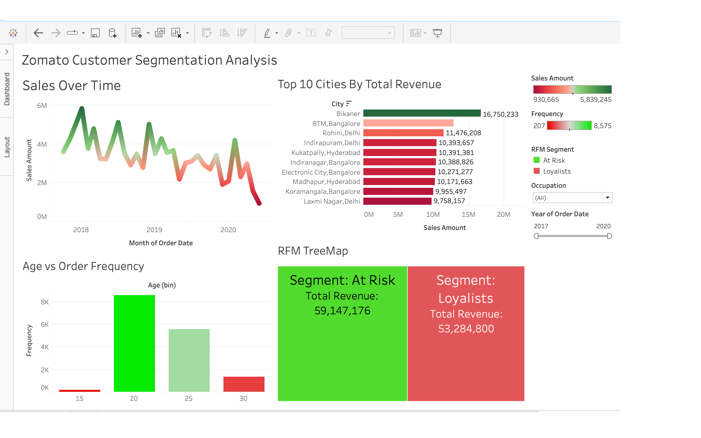

# Zomato Customer Behavioral & Revenue Analysis 📊

## 📋 Project Overview
This project analyzes **₹986M INR** in gross sales data to identify high-value customer demographics, behavioral patterns, and revenue distribution trends. The objective is to develop a strategic framework for **customer retention, segmentation, and geographic optimization**.

## 🖥️ Dashboard Preview

> **[View Interactive Dashboard on Tableau Public](https://public.tableau.com/app/profile/lentz.francois/viz/ZomatoFinalProjectWorkbook/RevenueCustomerSegments?publish=yes)**

## 🚀 Key Insights
* **The 20-Year-Old Peak:** Analysis shows the **15–30 age group** is the primary driver of order volume. The **20 and 25-year-old cohorts** represent the highest engagement, indicating strong dependence on early-career professionals and students.
* **Behavioral Segmentation (RFM):** Using an **RFM (Recency, Frequency, Monetary) model**, customers were segmented into behavioral groups. While 'Loyalists' provide consistent revenue, a significant portion of high-frequency users (especially ages 20–25) fall into the **'At Risk'** category, indicating potential revenue leakage.
* **Geographic Power Hubs:** Revenue is heavily concentrated in key regions. **Bikaner (₹16.7M)** emerges as a top-performing market, while **Bangalore** functions as a high-density transactional hub.

## 🛠️ Technical Methodology
* **Data Validation:** Verified transaction data to establish a **₹986M gross revenue baseline**.
* **Segmentation Logic:** Applied **RFM analysis** to classify users based on engagement and value contribution.
* **Dashboard Development:** Built an interactive Tableau dashboard with dynamic filters (Occupation, Year, Sales Amount) to support exploratory analysis and business decision-making.

## 📈 Strategic Recommendations
1. **Targeted Retention:** Implement “Win-Back” campaigns for **'At Risk' users**, particularly within the 20–25 age segment.
2. **Geographic Optimization:** Reallocate marketing spend toward high-performing regions such as **Bikaner and Bangalore** to maximize ROI and operational efficiency.
3. **Loyalty Program Design:** Introduce a student-focused loyalty tier to improve retention and transition high-frequency users from “At Risk” to “Loyalist” segments.

---
*Prepared by: Lentz Jean Francois, Marketing Intelligence Analyst*
